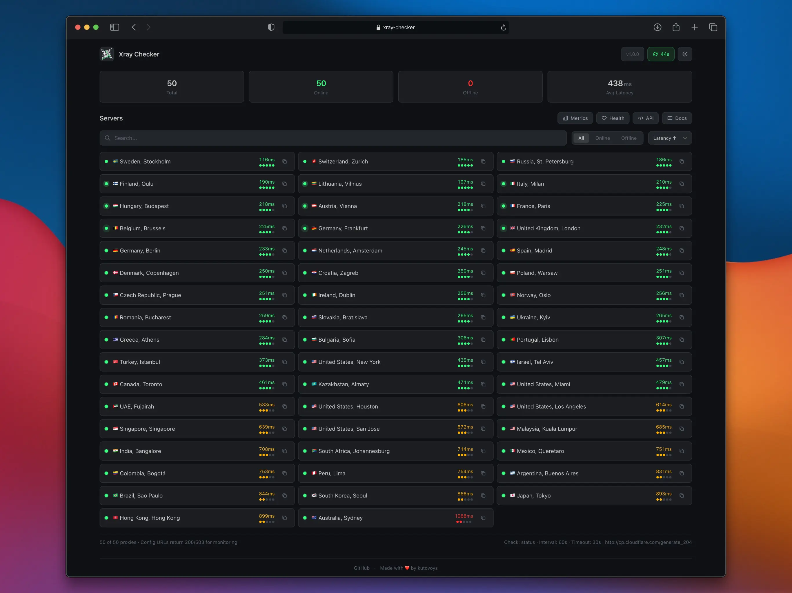

# Xray Checker

[](https://github.com/kutovoys/xray-checker/releases/latest)
[](https://github.com/kutovoys/xray-checker/actions/workflows/build-publish.yml)
[](https://hub.docker.com/r/kutovoys/xray-checker/)
[](https://xray-checker.kutovoy.dev/)
[](https://demo-xray-checker.kutovoy.dev/)
[](https://t.me/+uZCGx_FRY0tiOGIy)
[](https://github.com/kutovoys/xray-checker/blob/main/LICENSE)
[](https://github.com/kutovoys/xray-checker/blob/main/README_RU.md)
[](https://github.com/kutovoys/xray-checker/blob/main/README.md)

Xray Checker - это инструмент для мониторинга доступности прокси-серверов с поддержкой протоколов VLESS, VMess, Trojan и Shadowsocks. Он автоматически тестирует соединения через Xray Core и предоставляет метрики для Prometheus, а также API-эндпоинты для интеграции с системами мониторинга.

<div align="center">
  
</div>

> [!TIP]
> **Попробуйте демо:** Посмотрите Xray Checker в действии на [demo-xray-checker.kutovoy.dev](https://demo-xray-checker.kutovoy.dev/)

## 🚀 Основные возможности

- 🔍 Мониторинг работоспособности Xray-прокси серверов (VLESS, VMess, Trojan, Shadowsocks)
- 🔄 Автоматическое обновление конфигурации из подписки (поддержка нескольких подписок)
- 📊 Экспорт метрик в формате Prometheus с поддержкой Pushgateway
- 🌐 REST API с документацией OpenAPI/Swagger
- 🌓 Веб-интерфейс с темной/светлой темой
- 🎨 Полная кастомизация веб-интерфейса (свой логотип, стили или весь шаблон)
- 📄 Публичная страница статуса для VPN-сервисов (без аутентификации)
- 📥 Эндпоинты для интеграции с системами мониторинга (Uptime Kuma и др.)
- 🔒 Защита метрик и веб-интерфейса с помощью Basic Auth
- 🐳 Поддержка Docker и Docker Compose
- 🌍 Автоматическое управление geo-файлами (geoip.dat, geosite.dat)
- 📝 Гибкая загрузка конфигурации:
  - URL-подписки (base64, JSON)
  - Share-ссылки (vless://, vmess://, trojan://, ss://)
  - JSON-файлы конфигурации
  - Папки с конфигурациями

Полный список возможностей доступен в [документации](https://xray-checker.kutovoy.dev/ru/intro/features).

## 🚀 Быстрый старт

### Docker Compose из этого репозитория

Готовый [`compose.yaml`](compose.yaml) собирает локальный ARM64-образ, получает
ссылки подписок и HWID из `.env`, ограничивает число одновременных проверок до
20 и публикует панель только на самом Mac.

```bash
cp .env.example .env
```

Откройте `.env` и замените заглушки настоящими значениями. Несколько подписок
указываются через запятую в одной строке:

```dotenv
SUBSCRIPTION_URL="https://example.com/220v#220V,https://example.com/wssub#LETO,https://example.com/heltoma#MASTER"
HWID="ваш-hwid"
```

Часть после `#` задаёт название группы в панели и не отправляется серверу
подписки. Всё значение `SUBSCRIPTION_URL` должно оставаться в кавычках, иначе
`.env` воспримет `#` как начало комментария. Настоящие ссылки и HWID нельзя
добавлять в Git; файл `.env` уже исключён через `.gitignore`.

Запуск:

```bash
colima start iphone
DOCKER_CONTEXT=colima-iphone docker-compose up -d --build
```

После запуска панель доступна по адресу <http://127.0.0.1:2112>.

## Локальный запуск на macOS через сеть iPhone

В этой конфигурации основной Mac может оставаться в Wi-Fi-сети, а контейнер
работает внутри отдельного профиля Colima `iphone` и использует интернет iPhone,
подключённого по USB-C. Переменные `NETWORK_SSID` и `NETWORK_PASSWORD` для этого
не нужны: выбор сети выполняет Colima, а не Docker Compose.

### Что требуется

- macOS с установленными `colima`, `docker` и `docker-compose`;
- iPhone, подключённый по USB-C и отмеченный на Mac как доверенный;
- включённый на iPhone режим модема;
- отдельный профиль Colima с именем `iphone`.

Текущий проект уже рассчитан на существующий профиль `iphone`. Если его нужно
создать заново, сначала найдите имя USB-интерфейса:

```bash
networksetup -listallhardwareports
```

Найдите блок iPhone USB и запомните `Device`, например `en7`. Затем создайте
профиль, заменив `en7` на своё значение:

```bash
colima start iphone \
  --arch aarch64 \
  --cpus 2 \
  --memory 4 \
  --disk 30 \
  --network-address \
  --network-mode bridged \
  --network-interface en7 \
  --network-preferred-route \
  --dns 1.1.1.1 \
  --dns 8.8.8.8
```

При первой настройке macOS может запросить пароль администратора для сетевого
компонента Colima.

Префикс `DOCKER_CONTEXT=colima-iphone` важен: он направляет команду именно в
профиль iPhone и не затрагивает контейнеры обычного профиля `colima`.

### Повседневные команды

Проверить состояние:

```bash
colima status iphone
DOCKER_CONTEXT=colima-iphone docker-compose ps
```

Посмотреть логи:

```bash
DOCKER_CONTEXT=colima-iphone docker-compose logs -f xray-checker
```

Перезапустить панель после изменения `.env` или `compose.yaml`:

```bash
DOCKER_CONTEXT=colima-iphone docker-compose up -d --build --force-recreate
```

Остановить только Xray Checker, сохранив контейнер:

```bash
DOCKER_CONTEXT=colima-iphone docker-compose stop
```

Запустить его снова:

```bash
DOCKER_CONTEXT=colima-iphone docker-compose start
```

Полностью выключить отдельную виртуальную машину Colima:

```bash
colima stop iphone
```

После полного выключения запуск выполняется так:

```bash
colima start iphone
DOCKER_CONTEXT=colima-iphone docker-compose up -d
```

### Проверка и устранение проблем

Если панель не открывается, последовательно выполните:

```bash
colima status iphone
DOCKER_CONTEXT=colima-iphone docker-compose ps
DOCKER_CONTEXT=colima-iphone docker-compose logs --tail=100 xray-checker
curl -fsS http://127.0.0.1:2112/health
```

Ответ `OK` от последней команды означает, что веб-сервер работает. Ошибка
доступа к `docker.sock` обычно означает, что профиль `iphone` не запущен.

После отключения и повторного подключения iPhone безопаснее перезапустить
профиль:

```bash
colima stop iphone
colima start iphone
DOCKER_CONTEXT=colima-iphone docker-compose up -d
```

В `compose.yaml` установлены `PROXY_CHECK_CONCURRENCY=20` и интервал проверки
600 секунд. Неограниченная проверка сотен нод одновременно перегружает мобильный
канал и сервис определения IP, из-за чего появляются завышенный latency, `EOF`
и ложный статус offline.

Порт опубликован как `127.0.0.1:2112:2112`, поэтому панель доступна только на
этом Mac и не открыта для других устройств в локальной сети.

## Другие варианты запуска

### Docker без Compose

```bash
docker run -d \
  -e SUBSCRIPTION_URL=https://your-subscription-url/sub \
  -p 2112:2112 \
  kutovoys/xray-checker
```

### Минимальный Docker Compose

```yaml
services:
  xray-checker:
    image: kutovoys/xray-checker
    environment:
      - SUBSCRIPTION_URL=https://your-subscription-url/sub
    ports:
      - "2112:2112"
```

Подробная документация по установке и настройке доступна на [xray-checker.kutovoy.dev](https://xray-checker.kutovoy.dev/ru/intro/quick-start)

## 📈 Статистика проекта

<a href="https://star-history.com/#kutovoys/xray-checker&Date">
 <picture>
   <source media="(prefers-color-scheme: dark)" srcset="https://api.star-history.com/svg?repos=kutovoys/xray-checker&type=Date&theme=dark" />
   <source media="(prefers-color-scheme: light)" srcset="https://api.star-history.com/svg?repos=kutovoys/xray-checker&type=Date" />
   
 </picture>
</a>

## 🤝 Участие в разработке

Мы рады любому вкладу в развитие Xray Checker! Если вы хотите помочь:

1. Сделайте форк репозитория
2. Создайте ветку для ваших изменений
3. Внесите изменения и протестируйте их
4. Создайте Pull Request

Подробнее о том, как внести свой вклад, читайте в [руководстве для контрибьюторов](https://xray-checker.kutovoy.dev/ru/contributing/development-guide).

<p align="center">
Спасибо всем контрибьюторам, которые помогли улучшить Xray Checker:
</p>
<p align="center">
<a href="https://github.com/kutovoys/xray-checker/graphs/contributors">
  
</a>
</p>
<p align="center">
  Сделано с помощью <a rel="noopener noreferrer" target="_blank" href="https://contrib.rocks">contrib.rocks</a>
</p>

---

## Рекомендация VPN

Для безопасного и надежного доступа в интернет мы рекомендуем [BlancVPN](https://getblancvpn.com/pricing?promo=klugscl&ref=xc-readme). Используйте промокод `KLUGSCL` для получения скидки 15% на вашу подписку.
