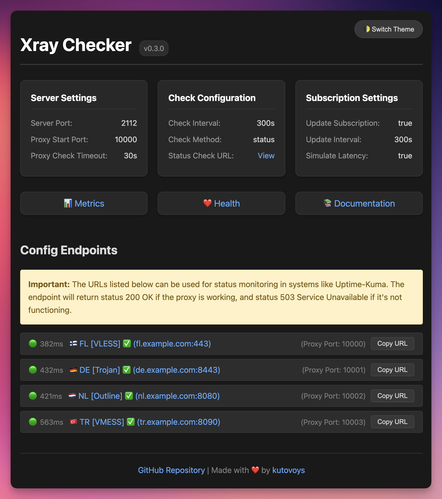

# Xray Checker

[](https://github.com/kutovoys/xray-checker/releases/latest)
[](https://github.com/kutovoys/xray-checker/actions/workflows/build-publish.yml)
[](https://hub.docker.com/r/kutovoys/xray-checker/)
[](https://xray-checker.kutovoy.dev/)
[](https://github.com/kutovoys/xray-checker/blob/main/LICENSE)
[](https://github.com/kutovoys/xray-checker/blob/main/README_RU.md)
[](https://github.com/kutovoys/xray-checker/blob/main/README.md)

Xray Checker - это инструмент для мониторинга доступности прокси-серверов с поддержкой протоколов VLESS, VMess, Trojan и Shadowsocks. Он автоматически тестирует соединения через Xray Core и предоставляет метрики для Prometheus, а также API-эндпоинты для интеграции с системами мониторинга.

<div align="center">
  
</div>

## 🚀 Основные возможности

- 🔍 Мониторинг работоспособности Xray-прокси серверов (VLESS, VMess, Trojan, Shadowsocks)
- 🔄 Автоматическое обновление конфигурации из подписки
- 📊 Экспорт метрик в формате Prometheus
- 🌓 Веб-интерфейс с темной/светлой темой
- 📥 Эндпоинты для интеграции с системами мониторинга
- 🔒 Защита метрик и веб-интерфейса с помощью Basic Auth
- 🐳 Поддержка Docker и Docker Compose
- 📝 Гибкая загрузка конфигурации:
  - URL-подписки
  - Base64-строки
  - JSON-файлы конфигурации
  - Папки с конфигурациями

Полный список возможностей доступен в [документации](https://xray-checker.kutovoy.dev/ru/intro/features).

## 🚀 Быстрый старт

### Docker

```bash
docker run -d \
  -e SUBSCRIPTION_URL=https://your-subscription-url/sub \
  -p 2112:2112 \
  kutovoys/xray-checker
```

### Docker Compose

```yaml
services:
  xray-checker:
    image: kutovoys/xray-checker
    environment:
      - SUBSCRIPTION_URL=https://your-subscription-url/sub
    ports:
      - "2112:2112"
```

Подробная документация по установке и настройке доступна на [xray-checker.kutovoy.dev](https://xray-checker.kutovoy.dev/ru/intro/quick-start)

## 📈 Статистика проекта

<iframe style="width:100%;height:auto;min-width:600px;min-height:400px;" src="https://star-history.com/embed#kutovoys/xray-checker&Date" frameBorder="0"></iframe>

## 🤝 Участие в разработке

Мы рады любому вкладу в развитие Xray Checker! Если вы хотите помочь:

1. Сделайте форк репозитория
2. Создайте ветку для ваших изменений
3. Внесите изменения и протестируйте их
4. Создайте Pull Request

Подробнее о том, как внести свой вклад, читайте в [руководстве для контрибьюторов](https://xray-checker.kutovoy.dev/ru/contributing/development-guide).
